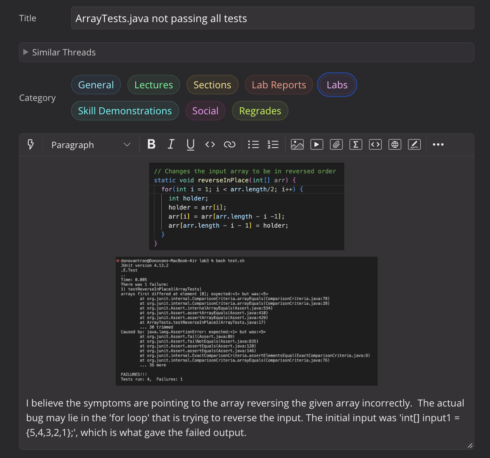
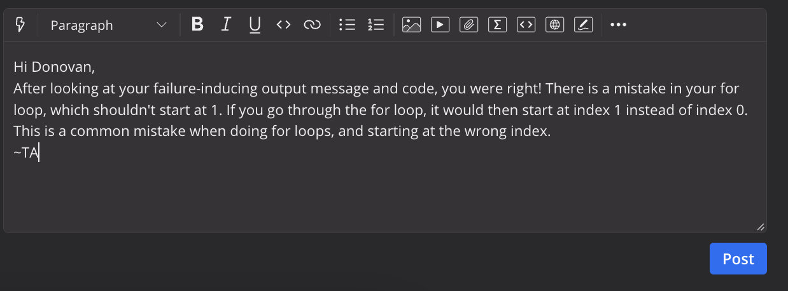
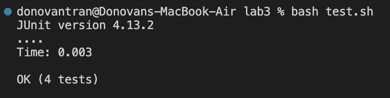
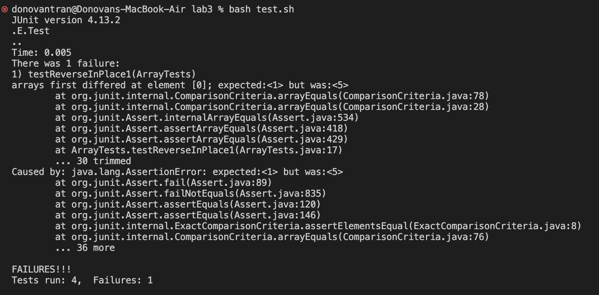
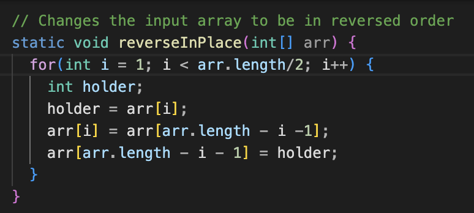

# Lab Report 5
---

Part 1
---

For Lab Report 5, I used the ArrayExamples.java and ArrayTests.java files to reproduce the intereaction between student and TA.

1. This is the intial post that Donovan made to EdStem about his `ArrayTests.java` file not passing all tests.

I believe that the post is correct in the fact that the failure inducing input was `int[] input1 = {5,4,3,2,1};`. This produced the symptoms that the terminal outputed. The guess was also correct that the problem most likely came from the `for` loop. The JUnit test expected that the first index be "1" but instead got a "5". This would be consistent with the expected output we would get if we were to reverse `input1` by hand.

2. This is the TA reponse after Donovan made his post to EdStem regarding the bug in his code.

The TA reponse refers to the code in `testReverseInPlace1`, which had a starting variable at 1. This means that when it is traversing the int array, it would start at index 1 instead of index 0. 

3. This is the terminal output after the student implemented the change the TA suggested. In this situation, the TA suggested that the student change the intial starting ponit of variable `i` in the for loop.

The test ran correctly!

4. In terms of file structure, as long as `ArrayExamples.java`, `ArrayTest.java`, and `test.sh` are witin the same directory, the code should be able to run. File contents should be pretty straight forward as well. `ArrayExamples.java` should contain the code to reverse the arrays and the code to run `ArrayTests.java`. `ArrayTest.java` contents contains the JUnit tests. `test.sh` has the bash script for complining and running the code. The full command line the trigger the bug was `bash test.sh`. This is because the bug lie within `ArrayExamples.java` and not a command within the terminal. The edit to the code that fixed the bug was simply changing the for loop's variable intial starting value from 1 to 0.

Here are some extra screen shots. 

Part 2
---
Coming in as a transfer student, I have learned a lot from this class. From understanding just how to use a terminals, paths, using VIM, and GitHub, there are many things that I took away from this class. One of the biggest skill I think I learned was being able to code and then use my terminal to work on the code remotely. It really broadened my understanding of how to work on code remotely. VIM was also really fun to use, I think I will defintely use VIM a decent amount when working remotely as well.

